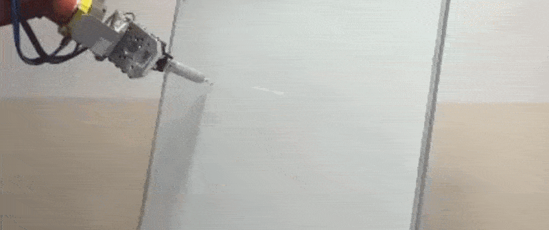
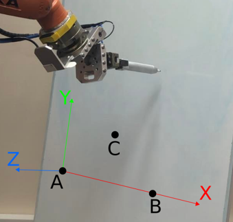
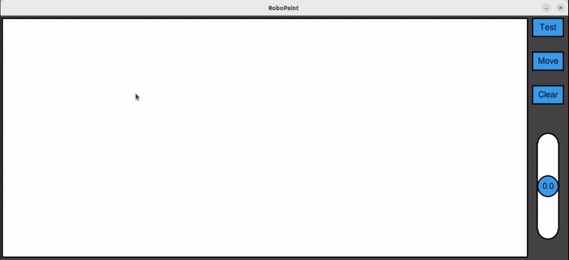

# RoboPaint

RoboPaint is an application that allows the user to manipulate a robot with their drawings in real-time.



## Requirements

* Python >=3.10
* pygame

## Installation

Ubuntu 22.04

```bash
git clone https://github.com/MarcinNarozny/RoboPaint.git
cd RoboPaint
python3 -m pip install -r requirements.txt
```

## Usage

Check the IP addresses of both the robot controller and the network card of the PC running the app. The port used by the app can be changed in the config file ('app/utils/config.txt'). The location of the robot's port may vary depending on the manufacturer.

To start the main app window, use:

```bash
cd RoboPaint
python3 -m app
```

You will be welcomed by a pop-up window indicating your current connection status. If everything is configured properly, the main app window will open.
Besides the drawing board, there are also special controls placed on the right side of the window:

1. Buttons:
    * Test - draws a rectangle on the real drawing surface, indicating the borders of the maximum drawing space. It is useful when setting up a robot's base.
    * Move - moves the robot away from the drawing surface. This button's functionality is also triggered when closing the app window.
    * Clear - erases app's canvas.
2. Slider - allows live fine-tuning of the robot's drawing tip Z axis. It is useful when the real drawing surface is not perfectly flat or when the drawing tip needs a little more pressure to draw more visibly.

## Robot setup

Coordinates are sent in batches, each containing 3 points, so that it is possible to utilise the robot's continuous movement and path approximation algorithms. Each batch is sent as a 36-byte-long stream. The same bytestream must be sent back to the app as confirmation. Point (0,0,0) of the robot's drawing base should be set in the targeted drawing surface's bottom-left corner, as in here:



If you don't have access to a robot but still want to test drive the app, you can run a connection simulating script along with the app:

```bash
cd RoboPaint
python3 dummy_robot.py
```

Coordiantes that would normally be sent to the robot will be printed in the script's terminal instead.

## Authors

* Marcin Narożny ([MarcinNarozny](https://github.com/MarcinNarozny))
* Maciej Nowicki ([mnowicki19](https://github.com/mnowicki19))

